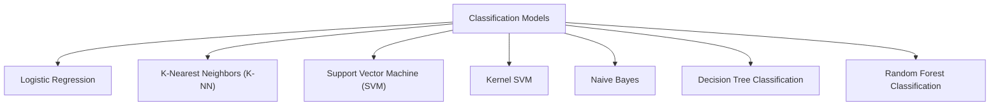

# Part 03 - Classification

* A supervised learning task where the goal is to assign input instances to a set of predefined categories or classes.

* Unlike regression where you predict a continuous number, you use classification to predict a category. There is a wide variety of classification applications from medicine to marketing. Classification models include *linear models* like *Logistic Regression*, *SVM*, and *nonlinear* ones like *K-NN*, *Kernel SVM* and *Random Forests*.

* In this part, you will understand and learn how to implement the following Machine Learning Classification models:
    1. Logistic Regression
    2. K-Nearest Neighbors (K-NN)
    3. Support Vector Machine (SVM)
    4. Kernel SVM
    5. Naive Bayes
    6. Decision Tree Classification
    7. Random Forest Classification

