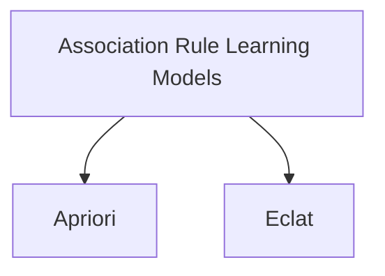

# Part 05 - Association Rule Learning

## Welcome to Part 5 - Association Rule Learning!

*`People who bought also bought ... That is what Association Rule Learning will help us figure out!`*

In this part, you will understand and learn how to implement the following Association Rule Learning models:
    1. `Apriori`
    2. `Eclat`

*Enjoy Machine Learning!*

