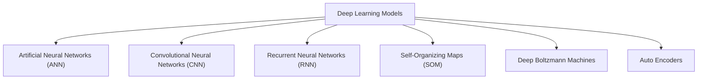

# Part 08 - Deep Learning

## Welcome to Part 8 - Deep Learning!

Deep Learning is the most exciting and powerful branch of Machine Learning. Deep Learning models can be used for a variety of complex tasks:

* *[Artificial Neural Networks for Regression and Classification](https://github.com/gandharvk422/Machine_Learning_A-Z/tree/main/Section%2036%20-%20Artificial%20Neural%20Networks%20(ANNs))*
* *[Convolutional Neural Networks for Computer Vision](https://github.com/gandharvk422/Machine_Learning_A-Z/tree/main/Section%2037%20-%20Convolutional%20Neural%20Networks%20(CNNs))*
* *Recurrent Neural Networks for Time Series Analysis*
* *Self Organizing Maps for Feature Extraction*
* *Deep Boltzmann Machines for Recommendation Systems*
* *Auto Encoders for Recommendation Systems*

In this part, you will understand and learn how to implement the following Deep Learning models:

1. *Artificial Neural Networks for a Business Problem*
2. *Convolutional Neural Networks for a Computer Vision task*
3. *Recurrent Neural Networks for Time Series Analysis*
4. *Self-Organizing Maps for Feature Extraction*
5. *Deep Boltzmann Machines for Recommendation Systems*
6. *Auto Encoders for Recommendation Systems*

*Enjoy Machine Learning!*

