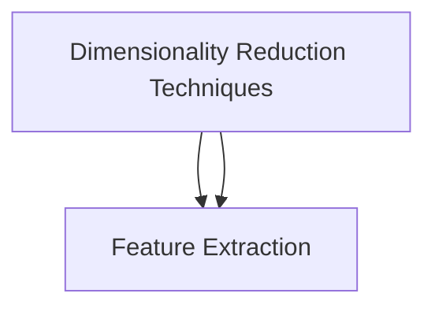
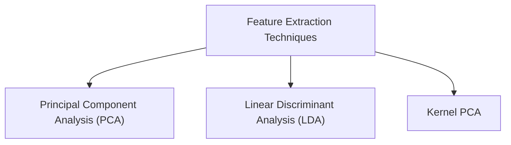

# Part 09: Dimensionality Reduction

## Welcome to Part 09 - Dimensionality Reduction

Welcome to Part 9 - Dimensionality Reduction

Remember in Part 3 - Classification, we worked with datasets composed of only two independent variables. We did for two reasons:
1. Because we needed two dimensions to visualize better how Machine Learning models worked (by plotting the prediction regions and the prediction boundary for each model).

2. Because whatever is the original number of our independent variables, we can often end up with two independent variables by applying an appropriate Dimensionality Reduction technique.

There are two types of Dimensionality Reduction techniques:
1. Feature Selection

2. Feature Extraction

Feature Selection techniques are *Backward Elimination*, *Forward Selection*, *Bidirectional Elimination*, *Score Comparison* and more. We covered these techniques in Part 2 - Regression.

In this part we will cover the following Extraction techniques:
1. Principal Component Analysis (PCA)

2. Linear Discriminant Analysis (LDA)

3. Kernel PCA

*Enjoy Machine Learning!*

